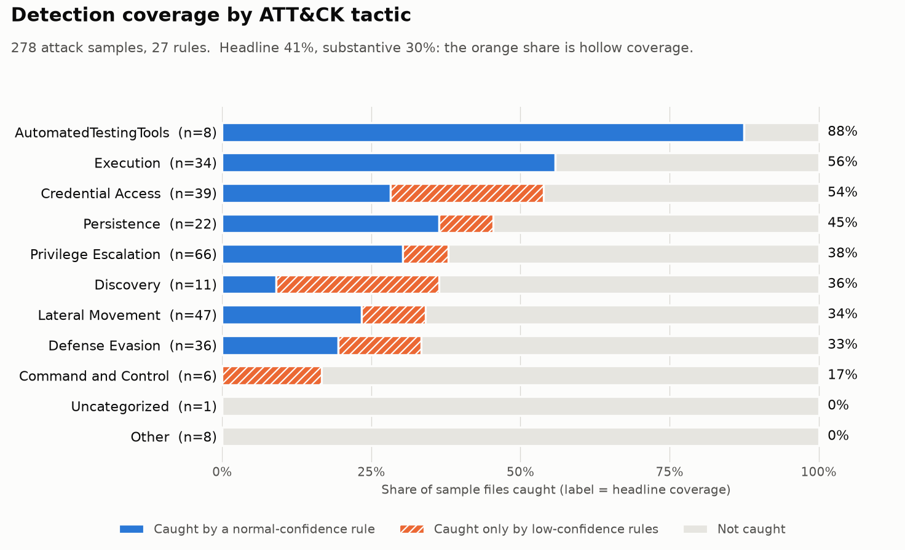

# Detection Engine

A rule-based detection engine that evaluates YAML detection rules against Windows
event logs and measures coverage against MITRE ATT&CK.

The engine parses `.evtx` files, matches events against a rule set, and reports
coverage per ATT&CK tactic. It is built around the idea that a coverage number is
only useful if you know how much of it is real.

## Coverage

Measured against 278 attack samples from
[EVTX-ATTACK-SAMPLES](https://github.com/sbousseaden/EVTX-ATTACK-SAMPLES),
using 27 rules.

```
TACTIC                        FILES  CAUGHT  COVERAGE
------------------------------------------------------
AutomatedTestingTools             8       7       88%
Command and Control               6       1       17%
Credential Access                39      21       54%
Defense Evasion                  36      12       33%
Discovery                        11       4       36%
Execution                        34      19       56%
Lateral Movement                 47      16       34%
Other                             8       0        0%
Persistence                      22      10       45%
Privilege Escalation             66      25       38%
Uncategorized                     1       0        0%
------------------------------------------------------
OVERALL                         278     115       41%

HEADLINE COVERAGE                      41%
SUBSTANTIVE COVERAGE                   30%
(files carried by low-confidence only)     31

RULE                                     FILES HIT
---------------------------------------------------
browser_spawns_shell                             4
create_remote_thread (low conf)                 10
credential_dump_commandline                      3
discovery_recon_burst                            3
event_log_cleared (low conf)                    26
lolbin_download                                  2
lsass_process_access                            13
lsass_query_only_access (low conf)               1
mshta_remote_execution                           2
ntds_extraction                                  1
powershell_suspicious_flags                      5
psexec_lateral_movement                          4
recovery_destruction                             1
registry_hive_dump                               1
registry_run_key_persistence                     9
regsvr32_scriptlet                               5
rundll32_lolbas_export                          11
scheduled_task_creation                          8
service_creation_commandline                     1
service_installed                                2
uac_bypass_parent                                8
uac_bypass_registry                              6
unbacked_call_trace                             24
wmi_event_subscription                           3
wmi_remote_execution                             1
wmiprvse_spawned_shell                           9
xsl_script_execution                             4
```



The chart splits each tactic's caught files into those caught by a
normal-confidence rule (blue) and those caught only by low-confidence rules
(orange). Command and Control's single detection is entirely orange, so its real
coverage is zero. Regenerate it with `python chart.py` after a scan.

Two figures are reported because they disagree, and the disagreement is the point.

**Headline coverage** counts any file where at least one rule fired.
**Substantive coverage** excludes files caught only by rules marked
`confidence: low` - rules that fire on activity that is real but not
characteristic of the technique the sample demonstrates.

Eleven points of apparent coverage are hollow. Reporting only the headline figure
would overstate what this rule set actually detects by more than a third.

## Design

**Rules are data, not code.** Each detection is a YAML file in `rules/`. The engine
has no knowledge of any specific rule. Adding a detection means adding a file.

**Matching semantics.** Fields within a rule are ANDed; values within a field are
ORed. Seven operators are supported:

| Operator | Behaviour |
|---|---|
| `equals` | exact string match |
| `equals_any` | exact match against a list |
| `contains_any` | substring match, any of |
| `contains_all` | substring match, all of |
| `not_contains` | exclusion |
| `bitmask_any` | hex value has any of these bits set |
| `bitmask_none` | hex value has none of these bits set |

The bitmask operators exist because Windows access rights cannot be matched as
strings: `0x1410` and `0x1FFFFF` both grant `PROCESS_VM_READ` but share no
substring.

**Log source scoping.** Event IDs are only unique within a provider, not globally.
Rules that match on event ID alone carry a `logsource` block constraining channel
or provider.

**Threshold rules.** Some behaviour is only suspicious in aggregate. A rule may
declare a `threshold` requiring N distinct values of a field across all matching
events, evaluated as a second stage after per-event matching.

**Relationship to Sigma.** [Sigma](https://github.com/SigmaHQ/sigma) is the open
standard most teams share detection rules in. This project's format is a smaller
one that the engine evaluates directly, which keeps the engine short and the
matching rules explicit. `sigma/` translates three rules to Sigma and records where
the translation is lossy: Sigma has no bitmask operator, and thresholds become
separate correlation rules.

## Findings

### 1. Most of my coverage number was not real

My first full run reported 45% coverage, and I nearly wrote that number down and
moved on. What stopped me was the per-rule breakdown: my log-clearing rule had
fired on 26 of 278 samples. Clearing the event log is a deliberate anti-forensic
act, so a rate of nearly one in ten looked wrong. When I listed the files, they
included samples named for Kerberos password spraying, BloodHound enumeration and
WMI lateral movement - none of which have any reason to involve log clearing.

I checked where in each file the matching event appeared. All 26 were the first
event in the file, with no exceptions. The person who captured this corpus cleared
the event log before each recording so the capture would be clean. My rule was
detecting the collection methodology, not the attack. Only two samples in the whole
corpus genuinely demonstrate adversary log clearing.

The rule itself is correct - I did not want to delete a detection for real
behaviour because one dataset was contaminated. Instead I added a `confidence`
field to the rule schema and marked the rules that fire on incidental activity. The
tool now reports two figures: headline coverage, which counts any file where a rule
fired, and substantive coverage, which excludes files carried only by
low-confidence rules. On the final rule set that is 41% against 30%. Eleven points
of my original number were hollow.

I kept this as the default output rather than a debug option, because the version
of this mistake that matters is a security team looking at a green dashboard and
believing techniques are covered when they are not.

### 2. Tightening a rule for precision quietly cost me a real detection

My LSASS rule originally matched any handle opened to `lsass.exe`. That overfires
badly - antivirus, inventory tools and Windows components open handles to LSASS
constantly, and in production this rule would bury an analyst.

I tightened it using the `GrantedAccess` field, which is a bitmask of the rights
the handle was granted. My reasoning was that credential dumping requires reading
LSASS memory, so `PROCESS_VM_READ` (0x10) must be set; handles granting only query
rights cannot reach credential material. This required adding a `bitmask_any`
operator to the engine, because `0x1410` and `0x1FFFFF` both grant read access but
share no substring, so string matching cannot express the condition.

Coverage barely moved - 14 files down to 13 - so I checked which file I had lost
rather than assuming the change was harmless. It was
`ppl_bypass_ppldump_knowdll_hijack`. PPLdump is a real credential dumping tool that
defeats Protected Process Light, and in that sample its only handles to LSASS were
`0x1000`, query rights only. My precision improvement had traded away a true
positive for a technique I specifically wanted to catch.

I did not want to pick a side of that trade, so I split the detection into two
tiers: a critical rule requiring memory access rights, and a separate
low-confidence rule for query-only handles. The signal is retained without
inflating the high-confidence alert count.

### 3. My own exclusion list hid the strongest event in the file

Investigating the sample above, I found something worse than the missing PPLdump
handles. The same file contained `services.exe` opening LSASS with
`PROCESS_ALL_ACCESS` (`0x001fffff`) - full rights, including memory read. That was
the actual credential access, and it was the highest-signal event in the capture.

My rule did not fire on it, because I had put `services.exe` on the `SourceImage`
exclusion list myself. That exclusion was not unreasonable in isolation:
`services.exe` is a signed SYSTEM process that touches LSASS in normal operation,
and without exclusions like it the rule is unusable. But the attack in this sample
was a KnownDlls hijack, which gets attacker code executing inside a trusted process
- so my allowlist was protecting the attacker.

The general lesson is that path-based allowlisting cannot survive code injection
into an allowlisted process, and getting code into a trusted process is a standard
objective rather than an exotic one. To fix this properly I would need signature or
hash verification on the source process, correlation with image load events to spot
the hijacked DLL, or exclusion by process lineage rather than by path. I recorded
the failure in the rule's tuning notes rather than removing the exclusions, since
removing them would make the rule unusable and would not address the underlying
weakness.

### 4. Some behaviour is only suspicious in aggregate

My reconnaissance rule matched any single enumeration utility - `whoami.exe`,
`nltest.exe`, `systeminfo.exe` and similar. It fired on 21 files and told me almost
nothing, because administrators run these commands constantly. A single `whoami` is
not an attack.

The real signal is several distinct utilities appearing together, which my engine
could not express: it evaluated one event at a time and had no way to reason about
a set of matches. I added a `threshold` stage that runs after per-event matching
and requires N distinct values of a chosen field before the rule fires. Rewritten
to require three distinct recon binaries, the rule dropped from 21 files to 3, and
the number of files carried only by low-confidence rules fell from 41 to 31.

Headline coverage fell from 45% to 41% as a result, while substantive coverage held
at 30%. I removed eighteen detections that were not telling me anything and lost no
real ones, and the two figures moved closer together - which is the outcome I
wanted, since the gap between them is the part of the number I cannot trust.

I am treating file boundary as a proxy for a time window here. Against live
telemetry this would need to be a windowed, per-host correlation, which this corpus
cannot support because it has no continuous timeline.

## False positives on benign data

Coverage only answers half the question. `baseline.py` answers the other half by
running the same rules over logs from a machine where nothing malicious happened,
so every alert is a candidate false positive.

**Data.** [NextronSystems/evtx-baseline](https://github.com/NextronSystems/evtx-baseline)
(Apache-2.0), `win10-client.tgz` from release v0.8.5: logs from a clean Windows 10 VM
with Sysmon installed, produced by installing common software and basic user
interaction. That is 352 `.evtx` files and 766,623 events.

```bash
curl -L -o win10-client.tgz https://github.com/NextronSystems/evtx-baseline/releases/download/v0.8.5/win10-client.tgz
mkdir benign && tar -xzf win10-client.tgz -C benign
python baseline.py benign/Logs_Client --show 5
```

The scan streams each log and splits the 800 MB Sysmon file across processes. It took
about 29 minutes on 2 cores. The full report is in `docs/baseline-report.txt`.

**Result.** 1,052 alerts across 766,623 events (13.7 per 10,000 events), all from just
two of the 352 files (the Sysmon log and `System.evtx`). 15 of the 27 rules never
fired. The 12 that did:

| Rule | Alerts | Per 10k | What set it off (from the samples reviewed) |
|---|---|---|---|
| `unbacked_call_trace` | 537 | 7.00 | `explorer.exe` accessing `RuntimeBroker.exe` |
| `registry_run_key_persistence` | 334 | 4.36 | an Opera installer writing registry values |
| `create_remote_thread` (low) | 63 | 0.82 | Windows Defender's `MsMpEng.exe` creating threads in installer processes |
| `lsass_query_only_access` (low) | 29 | 0.38 | a Zoom plugin, a Dropbox updater, a temporary installer |
| `lsass_process_access` | 28 | 0.37 | `MsiExec.exe`, the Windows Installer |
| `scheduled_task_creation` | 26 | 0.34 | `schtasks.exe` run by Office's updater and installers |
| `service_installed` | 26 | 0.34 | new services (Event ID 7045); service names not inspected |
| `credential_dump_commandline` | 3 | 0.04 | the word `minidump` inside a Dropbox crash-report URL |
| `powershell_suspicious_flags` | 2 | 0.03 | Office setup launching PowerShell with `-NoProfile -NonInteractive` |
| `uac_bypass_registry` | 2 | 0.03 | registry writes by a temporary installer executable |
| `event_log_cleared` (low) | 1 | 0.01 | Event ID 104 in `System.evtx` |
| `service_creation_commandline` | 1 | 0.01 | `sc.exe create` run by the Dropbox installer |

**What this shows.**

- Nine of the twelve rules that fired are normal-confidence rules, so the
  `confidence: low` tier does not cover the noise on this machine. The three
  low-confidence rules produced only 93 of the 1,052 alerts.
- `unbacked_call_trace` is the noisiest rule by a wide margin. It is also one of the
  most productive on the attack corpus (24 files), so the cost of tightening it is a
  trade-off to measure, as in finding 2.
- `lsass_process_access` fired on `MsiExec.exe` in every sample reviewed, a Windows
  component that is not on the rule's `SourceImage` exclusion list.
- `credential_dump_commandline` shows the limit of substring matching: a short keyword
  matched inside an unrelated URL.
- Alerts are events, not incidents. One installer run produced hundreds of registry
  alerts, so the number of cases an analyst would handle is far smaller than 1,052.
- No rules were changed in response. Changing them would move the coverage figures
  above, so each change should be re-measured against both corpora.

**Caveats.** This is one clean Windows 10 client VM observed for roughly a day, not a
server or domain environment. It was captured with a custom Sysmon configuration, so
absolute rates will differ under other configurations. The dataset is described as
goodware and the alerts that were reviewed all look like ordinary installer and
Windows behaviour, but the logs were not audited event by event. A rule that stays
silent here is encouraging, not proven precise.

## Limitations

- **Precision is only partly measurable.** The attack corpus has no benign activity,
  so `baseline.py` adds one public benign set (above). That is a single clean VM, so
  false-positive rates are indicative, not representative of a production network.
- **Threshold rules use file boundary as a proxy for a time window.** The corpus
  provides no continuous timeline. Against live telemetry these rules would need
  rewriting as windowed, per-host correlations.
- **No sequence or cross-host correlation.** Each event is evaluated independently
  apart from the threshold stage.
- **Windows event logs only, mostly Sysmon.** Most rules read Sysmon events. A few
  use other Windows sources (the Event Log provider for log clearing, the Service
  Control Manager for service installs). There is no Linux or macOS telemetry.

## Running it

```bash
python3 -m venv venv
source venv/bin/activate
pip install -r requirements.txt

git clone https://github.com/sbousseaden/EVTX-ATTACK-SAMPLES.git samples
python matrix.py samples
```

Single file:

```bash
python engine.py "samples/Execution/exec_driveby_cve-2018-15982_sysmon_1_10.evtx"
```

Tests and the coverage chart (these need `pip install -r requirements-dev.txt`):

```bash
python -m pytest -q                      # 70+ fast tests, no log files needed
EVTX_SAMPLES=samples python -m pytest -q # also runs the real-file integration tests
python chart.py                          # redraws docs/coverage.png from results.json
```

## Layout

```
engine.py            rule loading, matching, threshold evaluation
parse.py             EVTX to flat dictionaries (streaming, can split a file into chunks)
matrix.py            attack-corpus scan and coverage reporting
baseline.py          benign-log scan: false positives per rule
chart.py             draws the per-tactic coverage chart
peek.py              raw XML inspection for a single file
coverage.txt         saved copy of the coverage report
rules/               27 detection rules (this project's YAML format)
sigma/               3 of those rules translated to Sigma, with notes on the gaps
tests/               unit tests, plus integration tests that need real .evtx files
docs/coverage.png    the chart shown above
requirements.txt     runtime dependencies
requirements-dev.txt adds pytest and matplotlib
```

Neither sample corpus is vendored into this repository.
